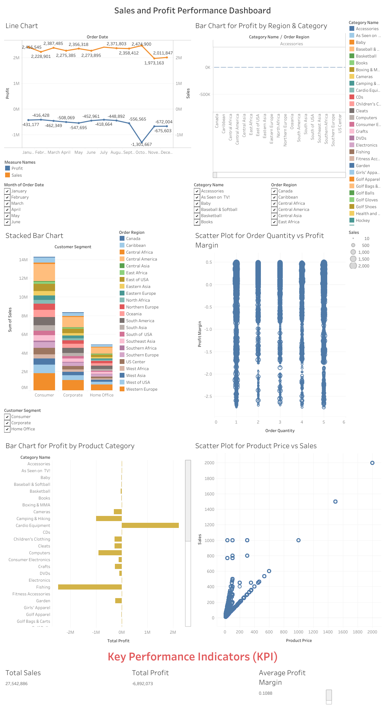

# Sales and Profit Performance Dashboard

## 📊 Project Overview

This project presents an interactive Tableau dashboard designed to analyze sales and profit performance. The dashboard provides a clear overview of key business metrics and helps identify sales trends, regional performance, and profitability across different segments and categories.

## 🎯 Objectives

- Analyze overall sales and profit performance.
- Identify sales trends over time.
- Compare sales and profitability across different regions.
- Analyze performance by category and segment.
- Present key business insights through an interactive dashboard.

## 🛠️ Tools & Technologies

- Tableau
- Microsoft Excel / CSV
- Data Visualization
- Data Analysis

## 📈 Key Features

- Interactive dashboard with filters and visualizations.
- KPI cards for Total Sales, Total Profit, and Average Profit Margin.
- Sales trend analysis.
- Regional profitability analysis.
- Category-wise and segment-wise performance analysis.
- Interactive filters for exploring the data.

## 🖼️ Dashboard Preview



## 🔗 Live Tableau Dashboard

[View the Interactive Dashboard on Tableau Public](https://public.tableau.com/app/profile/rashid.kamal/viz/Tableau_Mini_Project_17621023911830/Dashboard)

## 📁 Project Structure

```text
Sales_And_Profit_Dashboard/
│
├── Sales and Profit Performance Dashboard Mini Project.docx
│
|
├── Sales dataset.csv
| 
│
├── Tableau_Mini_Project.twbx
│    
│
├── Screenshots/
│   └── dashboard.png
│
└── README.md
